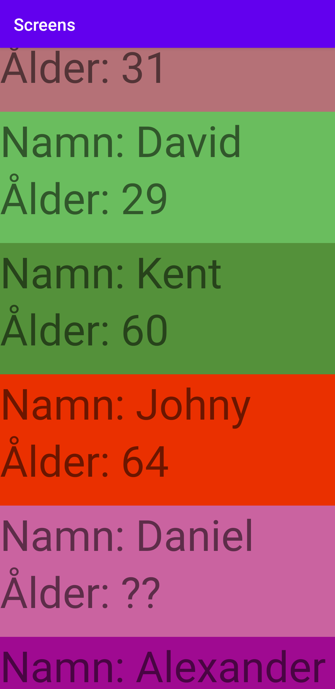
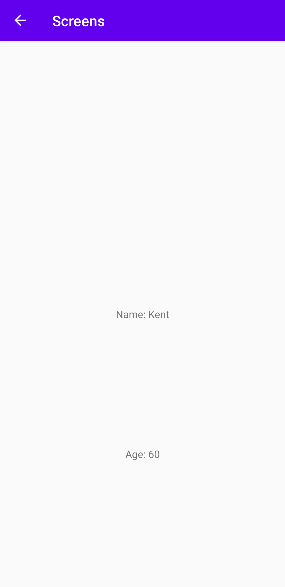

# Rapport

I den här uppgiften började jag med att implementera en andra aktivitet och med en knapp gå över till den. Men jag valde sedan att göra huvud aktiviteten till en recyclerView istället.
Innuti MainActitivy skapas en lista av object specifikt för recyclerViewn. I initierandet av RecycklerViewn i main så implemneteras även en ny OnClickListener.
RecycleVeiwn gör sin grej och skapar en lista med alla object som skapats i MainActitivy. Adpatern genom onClickListener kan känna av vilken av objecten som clickas på och genom det sätta en clickLyssnare på det Objectet.
När ett object har blivit klickat så startas den lyssnare som skapades i MainActivity och i den initieras ett nytt Intent som startar en ny Acitivity. När ett object clickas skickas det objected med som en variable till clicklyssnaren.
Den kan då genom geters hämta ut data från objected och skicka vidare genom Extras till den nya activityn, som i sig tar emot datan och visar upp den i två TextViews

Koden nedan visar i den andra aktiviteten hur datan tas emot när den skickats genom Extras. En Bundle skapas som tar emot allt som fanns med skickat
Sen kollas den om det var något med eller inte genom en if-stats. Skulle det vara med som tänkt så hämtas denna datan utifån en typ av variable namn som är i string och lägger den nya datan i egna variabler.

```
    Bundle extras = getIntent().getExtras();
    if (extras != null) {
        recycleName = extras.getString("name");
        recycleAge= extras.getString("age");
    }
```


  

